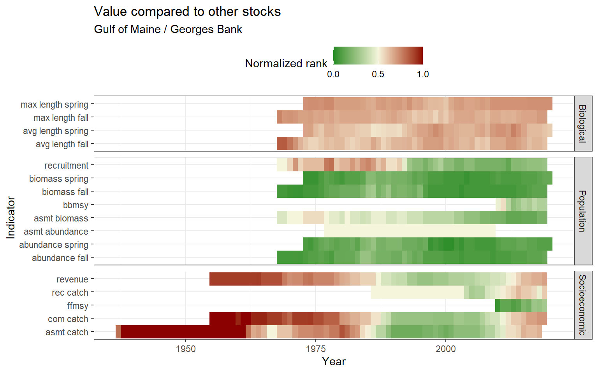
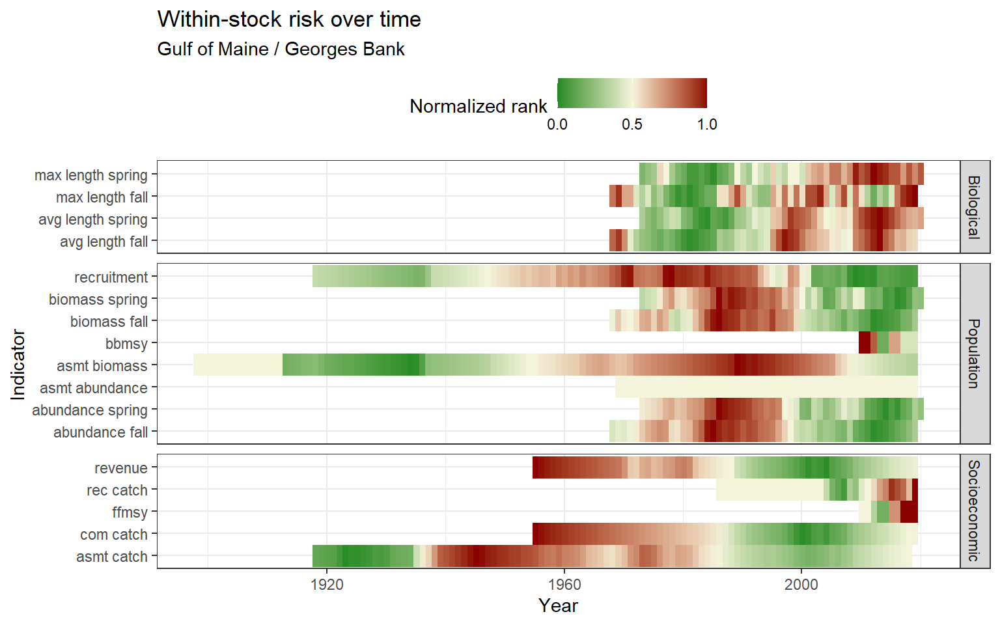

# Acadian redfish {-}


This is a preliminary report of previously collected data. This report is pulling information on all Northeast Acadian redfish stocks.

<!--chapter:end:index.Rmd-->


# Methods

Placeholder


## Stock identification
## Data collection and presentation
### `assessmentdata` methods
### `survdat` methods
## Risk assessment
### Risk across stocks
#### Suite of indicators
#### Individual indicators
### Risk within stocks

<!--chapter:end:01-methods.Rmd-->

# Habitat information

<!--chapter:end:02-habitat-title-page.Rmd-->

## Distribution


### Map of distribution
Strata maps were pulled and compiled using code from [NOAA/EDAB ECSA](https://github.com/NOAA-EDAB/ECSA). Please note, only fall and spring strata are shown on the map.
<div class="figure" style="text-align: center">

<p class="caption">(\#fig:ecsa_map)Acadian redfish</p>
</div>

### Latitude and longitude ranges
Latitude and longitude ranges were calculated from NOAA/EDAB ECSA [seasonal species strata](https://github.com/NOAA-EDAB/ECSA/blob/master/data/seasonal_stock_strata.csv) and [Bottom Trawl Survey (BTS) shapefiles](https://github.com/NOAA-EDAB/ECSA/tree/master/data/strata_shapefiles). The coordinate system is WGS84.
<div class="figure" style="text-align: center">
preservec145756c47145539
<p class="caption">(\#fig:latlong)Acadian redfish</p>
</div>

<!--chapter:end:03-latlong.Rmd-->


## Temperature
### Figures
### Summary
### Data

<!--chapter:end:04-temperature.Rmd-->


## Salinity
### Figures
### Summary
### Data

<!--chapter:end:05-salinity.Rmd-->


## Depth
### Figures

<!--chapter:end:06-depth.Rmd-->

## Habitat vulnerability


Habitat vulnerability information is sourced from the `ecodata` package. 


```
## [1] "NO DATA"
```

<!--chapter:end:07-habitat-vulnerability.Rmd-->

# Biological information

<!--chapter:end:08-biological-title-page.Rmd-->


## Length
### Figures
#### Risk {-}
### Summary
### Data

<!--chapter:end:09-length.Rmd-->


## von Bertalanffy growth curve
### Length at age growth curve

<!--chapter:end:10-von_b.Rmd-->


## Condition
### Figures
#### Length vs weight
#### Condition factor: Weight-volume
#### Condition factor: Relative weight
### Data
#### Length vs weight with weight-volume condition factor
#### Relative weight condition factor

<!--chapter:end:11-condition.Rmd-->


## Diet
### Figure
### Summary
### Data

<!--chapter:end:12-diet.Rmd-->

# Population information

<!--chapter:end:13-population-title-page.Rmd-->


## Abundance
### Figures
#### Survey abundance (raw measurements)
##### Risk {-}
#### Survey abundance (swept area estimates)
#### Assessment abundance
##### Risk {-}
### Survey summary
### Data
#### Survey data (raw measurements)
#### Survey data (swept area estimates)
#### Assessment data

<!--chapter:end:14-abundance.Rmd-->


## Biomass
### Figures
#### Survey biomass (raw measurements)
##### Risk {-}
#### Survey biomass (swept area estimates)
#### Assessment biomass
##### Risk {-}
### Survey summary
### Data
#### Survey data (raw measurements)
#### Survey data (swept area estimates)
#### Assessment data

<!--chapter:end:15-biomass.Rmd-->


## B/Bmsy 
### Figure
##### Risk {-}
### Data

<!--chapter:end:16-bbmsy.Rmd-->


## Recruitment
### Figure
##### Risk
### Data

<!--chapter:end:17-recruitment.Rmd-->


## Climate vulnerability
### Figures
### Data

<!--chapter:end:18-climate-vulnerability.Rmd-->

# Socio-economic information

<!--chapter:end:19-socio-economic-title-page.Rmd-->


# Management information

Placeholder


## Stock assessment and data quality information

<!--chapter:end:2-management.Rmd-->


## Catch
### Figures
#### Stock assessment catch
##### Risk {-}
#### Recreational catch
##### Risk {-}
#### Commercial catch
##### Risk {-}
#### Commercial vs recreational catch
### Data
#### Stock assessment catch
#### Recreational catch
#### Commercial catch
#### Commercial vs recreational catch
#### Commercial, recreational, and stock assessment catch

<!--chapter:end:20-catch.Rmd-->


## F/Fmsy 
### Figure
##### Risk {-}
### Data

<!--chapter:end:21-ffmsy.Rmd-->


## Revenue 
### Figure
##### Risk {-}
### Data

<!--chapter:end:22-revenue.Rmd-->

# Risk assessment


## Preliminary risk calculation

A preliminary risk analysis was conducted by ranking all species according to their indicator values. A high rank number and a normalized rank near 1 indicates that the species is at risk or of importance based on the measured indicator values. When a species was missing an indicator, it was assigned a normalized rank of 0.5.

### Relative to all other stocks

#### Comprehensive risk assessment
<div class="figure" style="text-align: center">
preserve87a1ce04382072a3
<p class="caption">(\#fig:risk_comp)Acadian redfish</p>
</div>

#### Ranked value as percent of historical value by year
<div class="figure" style="text-align: center">
preserveb2d3afcdbeb6d3c8
<p class="caption">(\#fig:risk_hist)Acadian redfish</p>
</div>

#### Ranked value in each year
<div class="figure" style="text-align: center">
preserve563053b601f2387a
<p class="caption">(\#fig:risk_year)Acadian redfish</p>
</div>

### Value within each stock, ranked by year
<div class="figure" style="text-align: center">
preserve464c676826b57e88
<p class="caption">(\#fig:risk_within)Acadian redfish</p>
</div>

## Preliminary risk visualization

### Relative to all other stocks

Risk was calculated over time for all indicators that were documented for five or more species in a given year. Risk was calculated as the average of the past 5 years, as a percent of the historical average. The normalized risk value plotted here reflects the normalized rank of this stock compared to all other stocks in that year.

#### Comprehensive risk assessment


#### Ranked value as percent of historical value by year
<div class="figure" style="text-align: center">

<p class="caption">(\#fig:year_risk_hist)Acadian redfish</p>
</div>

#### Ranked value in each year
<div class="figure" style="text-align: center">

<p class="caption">(\#fig:year_risk_value)Acadian redfish</p>
</div>

### Within a single stock

For each stock, a five-year running mean was calculated for each indicator. Indicator values were then ranked for all years where a value was present. The normalized risk values plotted here reflects the normalized rank of each year compared to all other years.

<div class="figure" style="text-align: center">

<p class="caption">(\#fig:stock_risk)Acadian redfish</p>
</div>

<!--chapter:end:23-risk-assessment.Rmd-->

