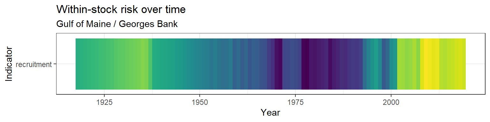

# Acadian redfish {-}


This is a preliminary report of previously collected data. This report is pulling information on all Northeast Acadian redfish stocks.

<!--chapter:end:index.Rmd-->

# Methods

## Stock identification
Northeast stocks were identified from NOAA/EDAB ECSA [seasonal species strata](https://github.com/NOAA-EDAB/ECSA/blob/master/data/seasonal_stock_strata.csv).

## Data collection and presentation

Data sources for each analysis are identified in the Results.

All continuous temporal data were plotted against time. If there were 30 or more years of data, a geom_gls regression line was fit (yellow = significant increase; purple = significant decrease; no line = no significant trend). If there were fewer than 30 years of data, no regression was fit.

### `assessmentdata` methods
Stock assessment and data quality information were compiled into a summary table.

B/Bmsy was classified as "DANGER" if it was below 1 and "GOOD" if it was above 1.

F/Fmsy was classified as "DANGER" if it was above 1 and "GOOD" if it was below 1.

### `survdat` methods
`survdat` data with zero abundance were not included in this analysis. Abundance and biomass were summed for each year and season. All other metrics were averaged for each year and season. The tables show summary statistics for the entire time series and for the most recent 5 years in the time series. 

## Risk assessment

### Risk across stocks

#### Suite of indicators
All stocks were ranked in order of increasing risk. The stock with the highest ranking is the stock determined to be at the highest risk. In this case, high risk has two meanings: (1) high importance (e.g., a stock with a high catch would have a high risk ranking for the catch indicator) or high vulnerability (e.g., a stock with low B/Bmsy would have a high risk ranking for the B/Bmsy indicator). The normalized rank was determined by dividing each stock's rank by the total number of stocks considered for that indicator. Stocks that were missing indicator measurements were assigned a normalized rank of 0.5.

#### Individual indicators
Risk was calculated over time for all indicators that were documented for five or more species in a given year. Risk was calculated as the average of the past 5 years, as a percent of the historical average. The normalized risk value was calculated as the normalized rank of this species compared to all other species in that year.

### Risk within stocks
The normalized risk value was calculated as the normalized rank of each yearly measurement compared to all other years.

<!--chapter:end:01-methods.Rmd-->

# Habitat information

<!--chapter:end:02-habitat-title-page.Rmd-->

## Distribution


### Map of distribution
Strata maps were pulled and compiled using code from [NOAA/EDAB ECSA](https://github.com/NOAA-EDAB/ECSA). Please note, only fall and spring strata are shown on the map.
<div class="figure" style="text-align: center">

<p class="caption">(\#fig:ecsa_map)Acadian redfish</p>
</div>

### Latitude and longitude ranges
Latitude and longitude ranges were calculated from NOAA/EDAB ECSA [seasonal species strata](https://github.com/NOAA-EDAB/ECSA/blob/master/data/seasonal_stock_strata.csv) and [Bottom Trawl Survey (BTS) shapefiles](https://github.com/NOAA-EDAB/ECSA/tree/master/data/strata_shapefiles). The coordinate system is WGS84.
<div class="figure" style="text-align: center">
preserve386f67ae20ae30cc
<p class="caption">(\#fig:latlong)Acadian redfish</p>
</div>

<!--chapter:end:03-latlong.Rmd-->

## Temperature


Surface and bottom temperature data were pulled from `survdat`. 

### Figures

Separate geom_gls() functions were fit for fall and spring measurements; trend lines are only shown when the trend was statistically significant, so some plots may have fewer than two trend lines. Fall has solid trend lines, and spring has dashed trend lines. Please note, sometimes the survey observed a small number of fish outside of the defined stock area.
<div class="figure" style="text-align: center">

<p class="caption">(\#fig:temp-1)Acadian redfish</p>
</div><div class="figure" style="text-align: center">

<p class="caption">(\#fig:temp-2)Acadian redfish</p>
</div>

### Summary
<div class="figure" style="text-align: center">
preserve3ebcd38be10b3e3a
<p class="caption">(\#fig:temp_summary)Acadian redfish</p>
</div><div class="figure" style="text-align: center">
preserveebfdeabac1059b8c
<p class="caption">(\#fig:temp_summary)Acadian redfish</p>
</div>

### Data
<div class="figure" style="text-align: center">
preserveb99a74c18caf88eb
<p class="caption">(\#fig:temp_data)Acadian redfish</p>
</div>

<!--chapter:end:04-temperature.Rmd-->

## Salinity


Surface and bottom salinity data were pulled from `survdat`. 

### Figures

Separate geom_gls() functions were fit for fall and spring measurements; trend lines are only shown when the trend was statistically significant, so some plots may have fewer than two trend lines. Fall has solid trend lines, and spring has dashed trend lines. Please note, sometimes the survey observed a small number of fish outside of the defined stock area.
<div class="figure" style="text-align: center">

<p class="caption">(\#fig:surfsalin-1)Acadian redfish</p>
</div><div class="figure" style="text-align: center">

<p class="caption">(\#fig:surfsalin-2)Acadian redfish</p>
</div>

### Summary
<div class="figure" style="text-align: center">
preservee102ba1f371fa6ac
<p class="caption">(\#fig:salin_summary)Acadian redfish</p>
</div><div class="figure" style="text-align: center">
preservef177241066e1443d
<p class="caption">(\#fig:salin_summary)Acadian redfish</p>
</div>

### Data
<div class="figure" style="text-align: center">
preserve0f9743f69dd8ab00
<p class="caption">(\#fig:salin_data)Acadian redfish</p>
</div>

<!--chapter:end:05-salinity.Rmd-->

## Depth
Ricky Tabandera


The range of depths that a species occupies is linked to many other habitat characteristics such as benthic structure, food availability, or temperature. Thus, observed depth can signal changes in habitat suitability. Changes in this metric can indicate the required resources are changing their distribution on the landscape. Seasonal differences in occurrence can also help identify essential habitat and the timing of migration to acquire seasonal resources 


### Figures

<div class="figure" style="text-align: center">

<p class="caption">(\#fig:depth_fig)Acadian redfish</p>
</div>

<div class="figure" style="text-align: center">

<p class="caption">(\#fig:depth_fig2)Acadian redfish</p>
</div>


<!--chapter:end:06-depth.Rmd-->

## Habitat vulnerability


Habitat vulnerability information is sourced from the `ecodata` package. 


```
## [1] "NO DATA"
```

<!--chapter:end:07-habitat-vulnerability.Rmd-->

# Biological information

<!--chapter:end:08-biological-title-page.Rmd-->

## Length


Length data were pulled from `survdat`. Only years with more than 10 fish lengths were considered for analysis. 

### Figures

Separate geom_gls() functions were fit for the minimum, mean, and maximum lengths; trend lines are only shown when the trend was statistically significant, so some plots may have fewer than three trend lines. Please note, sometimes the survey observed a small number of fish outside of the defined stock area.
<div class="figure" style="text-align: center">

<p class="caption">(\#fig:length-1)Acadian redfish</p>
</div><div class="figure" style="text-align: center">

<p class="caption">(\#fig:length-2)Acadian redfish</p>
</div><div class="figure" style="text-align: center">

<p class="caption">(\#fig:length-3)Acadian redfish</p>
</div>

#### Risk {-}

See Methods for risk calculation details.


##### Rank of change compared to historical, ranked among stocks {-}
<div class="figure" style="text-align: center">

<p class="caption">(\#fig:unnamed-chunk-38)Acadian redfish</p>
</div>

##### Rank of value (magnitude) compared to other stocks {-}
<div class="figure" style="text-align: center">

<p class="caption">(\#fig:unnamed-chunk-39)Acadian redfish</p>
</div>

##### Rank of value (magnitude) within a single stock, compared to all years {-}
<div class="figure" style="text-align: center">

<p class="caption">(\#fig:unnamed-chunk-40)Acadian redfish</p>
</div>

### Summary

|Season |Region             |Mean value +- SD (n fish, n years) |Mean value +- SD (n fish, past 5 years) |Range (total) |Range (past 5 years) |
|:------|:------------------|:----------------------------------|:---------------------------------------|:-------------|:--------------------|
|FALL   |all                |24.18 +- 6.12 (357,257, 57)        |24.9 +- 5.45 (45,149, 5)                |1 - 49        |3 - 44               |
|FALL   |Outside stock area |23.75 +- 6.81 (60,279, 57)         |22.48 +- 6.12 (9,685, 5)                |3 - 48        |4 - 46               |
|SPRING |all                |24.67 +- 6.11 (251,414, 52)        |25.21 +- 5.59 (36,486, 5)               |4 - 49        |4 - 44               |
|SPRING |Outside stock area |24.69 +- 5.4 (58,565, 52)          |24.29 +- 4.74 (10,760, 5)               |3 - 52        |5 - 43               |
|SUMMER |all                |25.14 +- 6.44 (7,019, 7)           |22.06 +- 5.41 (3,652, 3)                |4 - 44        |4 - 44               |
|SUMMER |Outside stock area |21.35 +- 6.33 (112, 3)             |20.24 +- 6.15 (78, 2)                   |6 - 37        |6 - 33               |

### Data
<div class="figure" style="text-align: center">
preserve828629af3533bee3
<p class="caption">(\#fig:length_data)Acadian redfish</p>
</div>

<!--chapter:end:09-length.Rmd-->

## von Bertalanffy growth curve

Ricky Tabandera


### Length at age growth curve

The predicted von Bertalanffy growth curve for NMFS managed fish species. Growth parameters of `Linf` (Length infinty), `K` (growth coefficient), and `t0` (size at time 0) were estimated using non-linear least square model. The starting point for model building is accomplished using `FSA::vbStarts`. Age and length data sourced from `survdat` and spans all years and survey areas. 


<div class="figure" style="text-align: center">

<p class="caption">(\#fig:single_growth_curve)Acadian redfish</p>
</div>

<!--chapter:end:10-von_b.Rmd-->

## Condition


Condition information comes from [diet data](https://github.com/Laurels1/Condition/blob/master/data/allfh.RData); only regions and seasons with more than 10 fish observations were considered. We calculated a rough condition factor as: Weight / Length^3, and relative weight was [previously calculated](https://github.com/Laurels1/Condition/tree/master/data).

### Figures

#### Length vs weight

Please note, no trend lines were fit, points are jittered to reduce overlap, and sometimes the survey observed a small number of fish outside of the defined stock area.
<div class="figure" style="text-align: center">

<p class="caption">(\#fig:lw)Acadian redfish</p>
</div>

#### Condition factor: Weight-volume

If there were more than 30 years of data, a geom_gls() regression was fit. In order to fit the geom_gls() regression, we calculated the mean condition factor for each year and plotted the geom_gls() through those points. Please note, points are jittered to reduce overlap, and sometimes the survey observed a small number of fish outside of the defined stock area.
<div class="figure" style="text-align: center">

<p class="caption">(\#fig:condition)Acadian redfish</p>
</div>

#### Condition factor: Relative weight

Please note, this data is aggregated by Ecological Protection Unit (EPU), which may differ slightly from the stock assessment regions.
<div class="figure" style="text-align: center">

<p class="caption">(\#fig:laurel_cond)Acadian redfish</p>
</div>

### Data

#### Length vs weight with weight-volume condition factor
<div class="figure" style="text-align: center">
preserve685fca3935513b36
<p class="caption">(\#fig:lw_data)Acadian redfish</p>
</div>

#### Relative weight condition factor
Please note, this data is aggregated by Ecological Protection Unit (EPU), which may differ slightly from the stock assessment regions.
<div class="figure" style="text-align: center">
preserve69880481029e1f9e
<p class="caption">(\#fig:laurel_cond_data)Acadian redfish</p>
</div>

<!--chapter:end:11-condition.Rmd-->

## Diet


Diet data were compiled from [existing data](https://github.com/Laurels1/Condition/blob/master/data/allfh.RData). For analysis, all geographic samples were grouped by season, year, and region, and only year-season-region combinations with more than 20 predators sampled were considered. Prey items that made up more than 5% of the predator's diet in at least one year-season-region were identified to the broad category level; all other prey are grouped into the "other" category.

### Figure
<div class="figure" style="text-align: center">

<p class="caption">(\#fig:diet)Acadian redfish</p>
</div>

### Summary

|Prey category  |Season |Region             |Mean proportion +- SD (n years) |Range         |
|:--------------|:------|:------------------|:-------------------------------|:-------------|
|ANIMAL_REMAINS |FALL   |all                |0.028 +- 0.027 ()               |0.001 - 0.088 |
|ANIMAL_REMAINS |FALL   |Outside stock area |0.032 +- NA ()                  |0.032 - 0.032 |
|ANIMAL_REMAINS |SPRING |all                |0.023 +- 0.019 ()               |0 - 0.059     |
|ARTHROPODA     |FALL   |all                |0.873 +- 0.098 ()               |0.603 - 0.991 |
|ARTHROPODA     |FALL   |Outside stock area |0.968 +- NA ()                  |0.968 - 0.968 |
|ARTHROPODA     |SPRING |all                |0.762 +- 0.268 ()               |0.055 - 0.991 |
|FISH           |FALL   |all                |0.11 +- 0.086 ()                |0.047 - 0.392 |
|FISH           |SPRING |all                |0.257 +- 0.282 ()               |0 - 0.936     |
|OTHER          |FALL   |all                |0.024 +- 0.028 ()               |0 - 0.094     |
|OTHER          |SPRING |all                |0.012 +- 0.014 ()               |0 - 0.047     |
|UROCHORDATA    |FALL   |all                |0.024 +- 0.029 ()               |0.003 - 0.074 |
|UROCHORDATA    |SPRING |all                |0.032 +- 0.026 ()               |0.013 - 0.05  |

### Data
<div class="figure" style="text-align: center">
preserveb8d4b9f0256fa632
<p class="caption">(\#fig:diet_data)Acadian redfish</p>
</div>

<!--chapter:end:12-diet.Rmd-->

# Population information

<!--chapter:end:13-population-title-page.Rmd-->

## Abundance


Abundance data were pulled from `survdat` and `assessmentdata::stockAssessmentData`. 

### Figures

Separate geom_gls() functions were fit for fall and spring measurements; trend lines are only shown when the trend was statistically significant, so some plots may have fewer than two trend lines. Fall has solid trend lines, and spring has dashed trend lines. Please note, sometimes the survey observed a small number of fish outside of the defined stock area.

#### Survey abundance (raw measurements)
<div class="figure" style="text-align: center">

<p class="caption">(\#fig:abun_survey)Acadian redfish</p>
</div>

##### Risk {-}

See Methods for risk calculation details.


##### Rank of change compared to historical, ranked among stocks {-}
<div class="figure" style="text-align: center">

<p class="caption">(\#fig:unnamed-chunk-42)Acadian redfish</p>
</div>

##### Rank of value (magnitude) compared to other stocks {-}
<div class="figure" style="text-align: center">

<p class="caption">(\#fig:unnamed-chunk-43)Acadian redfish</p>
</div>

##### Rank of value (magnitude) within a single stock, compared to all years {-}
<div class="figure" style="text-align: center">

<p class="caption">(\#fig:unnamed-chunk-44)Acadian redfish</p>
</div>

#### Survey abundance (swept area estimates)

Please note, these estimates are not parsed by region or season. Swept area estimates are based on spring and fall surveys only. The shaded gray region indicates +/- two standard errors.
<div class="figure" style="text-align: center">

<p class="caption">(\#fig:abun_survey_swept)Acadian redfish</p>
</div>

#### Assessment abundance


```
## [1] "NO DATA"
```

##### Risk {-}

See Methods for risk calculation details.


##### Rank of change compared to historical, ranked among stocks {-}

```
## [1] "No Gulf of Maine / Georges Bank data"
```

##### Rank of value (magnitude) compared to other stocks {-}

```
## [1] "No Gulf of Maine / Georges Bank data"
```

##### Rank of value (magnitude) within a single stock, compared to all years {-}

```
## [1] "NO Gulf of Maine / Georges Bank DATA"
```

### Survey summary
<div class="figure" style="text-align: center">
preserveb694e843f8168f41
<p class="caption">(\#fig:abun_summary)Acadian redfish</p>
</div>

### Data

#### Survey data (raw measurements)
<div class="figure" style="text-align: center">
preserve1b9eed7570d4e9d4
<p class="caption">(\#fig:surv_abun_data)Acadian redfish</p>
</div>

#### Survey data (swept area estimates)
<div class="figure" style="text-align: center">
preserve849e3e3f52e931f3
<p class="caption">(\#fig:swept_abun_data)Acadian redfish</p>
</div>

#### Assessment data

```
## [1] "NO DATA"
```

<!--chapter:end:14-abundance.Rmd-->


## Biomass

Biomass data were pulled from `survdat`. 

### Figures

Separate geom_gls() functions were fit for fall and spring measurements; trend lines are only shown when the trend was statistically significant, so some plots may have fewer than two trend lines. Fall has solid trend lines, and spring has dashed trend lines. Please note, sometimes the survey observed a small number of fish outside of the defined stock area.

#### Survey biomass (raw measurements)
<div class="figure" style="text-align: center">

<p class="caption">(\#fig:biomass)Acadian redfish</p>
</div>

##### Risk {-}

See Methods for risk calculation details.


##### Rank of change compared to historical, ranked among stocks {-}
<div class="figure" style="text-align: center">

<p class="caption">(\#fig:unnamed-chunk-49)Acadian redfish</p>
</div>

##### Rank of value (magnitude) compared to other stocks {-}
<div class="figure" style="text-align: center">

<p class="caption">(\#fig:unnamed-chunk-50)Acadian redfish</p>
</div>

##### Rank of value (magnitude) within a single stock, compared to all years {-}
<div class="figure" style="text-align: center">

<p class="caption">(\#fig:unnamed-chunk-51)Acadian redfish</p>
</div>

#### Survey biomass (swept area estimates)

Please note, these estimates are not parsed by region or season. Swept area estimates are based on spring and fall surveys only. The shaded gray region indicates +/- two standard errors.
<div class="figure" style="text-align: center">

<p class="caption">(\#fig:bio_survey_swept)Acadian redfish</p>
</div>

#### Assessment biomass


<div class="figure" style="text-align: center">

<p class="caption">(\#fig:biomass_asmt)Acadian redfish</p>
</div>

##### Risk {-}

See Methods for risk calculation details.


##### Rank of change compared to historical, ranked among stocks {-}
<div class="figure" style="text-align: center">

<p class="caption">(\#fig:unnamed-chunk-52)Acadian redfish</p>
</div>

##### Rank of value (magnitude) compared to other stocks {-}
<div class="figure" style="text-align: center">

<p class="caption">(\#fig:unnamed-chunk-53)Acadian redfish</p>
</div>

##### Rank of value (magnitude) within a single stock, compared to all years {-}
<div class="figure" style="text-align: center">

<p class="caption">(\#fig:unnamed-chunk-54)Acadian redfish</p>
</div>

### Survey summary
<div class="figure" style="text-align: center">
preserve9ebf0a0e32e33b51
<p class="caption">(\#fig:biomass_summary)Acadian redfish</p>
</div>

### Data

#### Survey data (raw measurements)
<div class="figure" style="text-align: center">
preserved6c78aad175249b6
<p class="caption">(\#fig:biomass_data)Acadian redfish</p>
</div>

#### Survey data (swept area estimates)
<div class="figure" style="text-align: center">
preserveaef530ec13752651
<p class="caption">(\#fig:swept_biomass_data)Acadian redfish</p>
</div>

#### Assessment data
<div class="figure" style="text-align: center">
preservea344410620054a03
<p class="caption">(\#fig:asmt_biomass_data)Acadian redfish</p>
</div>

<!--chapter:end:15-biomass.Rmd-->


## B/Bmsy 

B/Bmsy data were pulled from `assessmentdata::stockAssessmentSummary`.

The most recent status of B/Bmsy is: GOOD

### Figure
<div class="figure" style="text-align: center">

<p class="caption">(\#fig:bbmsy_fig)Acadian redfish</p>
</div>

##### Risk {-}

See Methods for risk calculation details.


##### Rank of change compared to historical, ranked among stocks {-}
<div class="figure" style="text-align: center">

<p class="caption">(\#fig:unnamed-chunk-56)Acadian redfish</p>
</div>

##### Rank of value (magnitude) compared to other stocks {-}
<div class="figure" style="text-align: center">

<p class="caption">(\#fig:unnamed-chunk-57)Acadian redfish</p>
</div>

##### Rank of value (magnitude) within a single stock, compared to all years {-}
<div class="figure" style="text-align: center">

<p class="caption">(\#fig:unnamed-chunk-58)Acadian redfish</p>
</div>

### Data
<div class="figure" style="text-align: center">
preserve8735752406bbff8c
<p class="caption">(\#fig:bbmsy_data)Acadian redfish</p>
</div>

<!--chapter:end:16-bbmsy.Rmd-->

## Recruitment


Recruitment data were pulled from `assessmentdata::stockAssessmentData`. Separate geom_gls() functions were fit for each region; trend lines are only shown when the trend was statistically significant, so some plots may have fewer trend lines than regions.

### Figure


<div class="figure" style="text-align: center">

<p class="caption">(\#fig:recruitment)Acadian redfish</p>
</div>

##### Risk

See Methods for risk calculation details.


##### Rank of change compared to historical, ranked among stocks {-}
<div class="figure" style="text-align: center">

<p class="caption">(\#fig:unnamed-chunk-60)Acadian redfish</p>
</div>

##### Rank of value (magnitude) compared to other stocks {-}
<div class="figure" style="text-align: center">

<p class="caption">(\#fig:unnamed-chunk-61)Acadian redfish</p>
</div>

##### Rank of value (magnitude) within a single stock, compared to all years {-}
<div class="figure" style="text-align: center">

<p class="caption">(\#fig:unnamed-chunk-62)Acadian redfish</p>
</div>

### Data

<div class="figure" style="text-align: center">
preserve5f06bf5be2764d11
<p class="caption">(\#fig:recruit_data)Acadian redfish</p>
</div>

<!--chapter:end:17-recruitment.Rmd-->

## Climate vulnerability


Climate vulnerability is sourced from Hare et al. (2016). The overall climate score for Acadian redfish was moderate with high certainty.


### Figures
<div class="figure" style="text-align: center">

<p class="caption">(\#fig:unnamed-chunk-23-1)Acadian redfish</p>
</div><div class="figure" style="text-align: center">

<p class="caption">(\#fig:unnamed-chunk-23-2)Acadian redfish</p>
</div>

### Data
<div class="figure" style="text-align: center">
preserve4ff2fff1c4f5cc8e
<p class="caption">(\#fig:unnamed-chunk-24)Acadian redfish</p>
</div>

<!--chapter:end:18-climate-vulnerability.Rmd-->

# Socio-economic information

<!--chapter:end:19-socio-economic-title-page.Rmd-->

## Catch


Stock assessment catch data are from `assessmentdata::stockAssessmentData`. Recreational catch data were downloaded from [NOAA MRIP](https://www.st.nmfs.noaa.gov/st1/recreational/MRIP_Estimate_Data/CSV/). Commercial catch data were downloaded from [NOAA FOSS](https://foss.nmfs.noaa.gov/apexfoss/f?p=215:200:4615327020711::NO:::).

### Figures


#### Stock assessment catch
<div class="figure" style="text-align: center">

<p class="caption">(\#fig:catch)Acadian redfish</p>
</div>

##### Risk {-}

See Methods for risk calculation details.


##### Rank of change compared to historical, ranked among stocks {-}
<div class="figure" style="text-align: center">

<p class="caption">(\#fig:unnamed-chunk-64)Acadian redfish</p>
</div>

##### Rank of value (magnitude) compared to other stocks {-}
<div class="figure" style="text-align: center">

<p class="caption">(\#fig:unnamed-chunk-65)Acadian redfish</p>
</div>

##### Rank of value (magnitude) within a single stock, compared to all years {-}
<div class="figure" style="text-align: center">

<p class="caption">(\#fig:unnamed-chunk-66)Acadian redfish</p>
</div>

#### Recreational catch
<div class="figure" style="text-align: center">

<p class="caption">(\#fig:rec)Acadian redfish</p>
</div>

##### Risk {-}

See Methods for risk calculation details.


##### Rank of change compared to historical, ranked among stocks {-}
<div class="figure" style="text-align: center">

<p class="caption">(\#fig:unnamed-chunk-67)Acadian redfish</p>
</div>

##### Rank of value (magnitude) compared to other stocks {-}
<div class="figure" style="text-align: center">

<p class="caption">(\#fig:unnamed-chunk-68)Acadian redfish</p>
</div>

##### Rank of value (magnitude) within a single stock, compared to all years {-}
<div class="figure" style="text-align: center">

<p class="caption">(\#fig:unnamed-chunk-69)Acadian redfish</p>
</div>

#### Commercial catch
<div class="figure" style="text-align: center">

<p class="caption">(\#fig:com)Acadian redfish</p>
</div>

##### Risk {-}

See Methods for risk calculation details.


##### Rank of change compared to historical, ranked among stocks {-}
<div class="figure" style="text-align: center">

<p class="caption">(\#fig:unnamed-chunk-70)Acadian redfish</p>
</div>

##### Rank of value (magnitude) compared to other stocks {-}
<div class="figure" style="text-align: center">

<p class="caption">(\#fig:unnamed-chunk-71)Acadian redfish</p>
</div>

##### Rank of value (magnitude) within a single stock, compared to all years {-}
<div class="figure" style="text-align: center">

<p class="caption">(\#fig:unnamed-chunk-72)Acadian redfish</p>
</div>

#### Commercial vs recreational catch
<div class="figure" style="text-align: center">

<p class="caption">(\#fig:comvrec)Acadian redfish</p>
</div>

### Data

#### Stock assessment catch
<div class="figure" style="text-align: center">
preserve6096eb1ad2958471
<p class="caption">(\#fig:catch_data)Acadian redfish</p>
</div>

#### Recreational catch
<div class="figure" style="text-align: center">
preserve30d7edc8dfccac0a
<p class="caption">(\#fig:rec_data)Acadian redfish</p>
</div>

#### Commercial catch
<div class="figure" style="text-align: center">
preserve74c2017073812692
<p class="caption">(\#fig:com_data)Acadian redfish</p>
</div>

#### Commercial vs recreational catch
<div class="figure" style="text-align: center">
preserve749cfcdd6692ccce
<p class="caption">(\#fig:comvrec_data)Acadian redfish</p>
</div>

#### Commercial, recreational, and stock assessment catch
<div class="figure" style="text-align: center">
preserved70dd013ea968d5b
<p class="caption">(\#fig:all_catch)Acadian redfish</p>
</div>


<!--chapter:end:20-catch.Rmd-->

## F/Fmsy 


F/Fmsy data were pulled from `assessmentdata::stockAssessmentSummary`.

The most recent status of F/Fmsy is: GOOD

### Figure
<div class="figure" style="text-align: center">

<p class="caption">(\#fig:ffmsy)Acadian redfish</p>
</div>

##### Risk {-}

See Methods for risk calculation details.


##### Rank of change compared to historical, ranked among stocks {-}
<div class="figure" style="text-align: center">

<p class="caption">(\#fig:unnamed-chunk-74)Acadian redfish</p>
</div>

##### Rank of value (magnitude) compared to other stocks {-}
<div class="figure" style="text-align: center">

<p class="caption">(\#fig:unnamed-chunk-75)Acadian redfish</p>
</div>

##### Rank of value (magnitude) within a single stock, compared to all years {-}
<div class="figure" style="text-align: center">

<p class="caption">(\#fig:unnamed-chunk-76)Acadian redfish</p>
</div>

### Data
<div class="figure" style="text-align: center">
preserveade96940a01d569e
<p class="caption">(\#fig:ffmsy_data)Acadian redfish</p>
</div>

<!--chapter:end:21-ffmsy.Rmd-->

## Revenue 


Commercial catch data were downloaded from [NOAA FOSS](https://foss.nmfs.noaa.gov/apexfoss/f?p=215:200:4615327020711::NO:::).

### Figure
<div class="figure" style="text-align: center">

<p class="caption">(\#fig:revenue)Acadian redfish</p>
</div>

##### Risk {-}

See Methods for risk calculation details.


##### Rank of change compared to historical, ranked among stocks {-}
<div class="figure" style="text-align: center">

<p class="caption">(\#fig:unnamed-chunk-77)Acadian redfish</p>
</div>

##### Rank of value (magnitude) compared to other stocks {-}
<div class="figure" style="text-align: center">

<p class="caption">(\#fig:unnamed-chunk-78)Acadian redfish</p>
</div>

##### Rank of value (magnitude) within a single stock, compared to all years {-}
<div class="figure" style="text-align: center">

<p class="caption">(\#fig:unnamed-chunk-79)Acadian redfish</p>
</div>

### Data
<div class="figure" style="text-align: center">
preservee813f364cfa15d82
<p class="caption">(\#fig:revenue_data)Acadian redfish</p>
</div>

<!--chapter:end:22-revenue.Rmd-->

# Management information


## Stock assessment and data quality information
Stock assessment and data quality information were pulled from `assessmentdata::stockAssessmentSummary`.
<div class="figure" style="text-align: center">
preserve0d5d6f52750ab459
<p class="caption">(\#fig:quality)Acadian redfish</p>
</div>

<!--chapter:end:23-management.Rmd-->

# Risk assessment


A preliminary risk analysis was conducted by ranking all species according to their indicator values. A high rank number and a normalized rank near 1 indicates that the species is at risk or of importance based on the measured indicator values. When a species was missing an indicator, it was assigned a normalized rank of 0.5.

## Figures

### Relative to all other stocks

Risk was calculated over time for all indicators that were documented for five or more species in a given year. Risk was calculated as the average of the past 5 years, as a percent of the historical average. The normalized risk value plotted here reflects the normalized rank of this stock compared to all other stocks in that year.

#### Comprehensive risk assessment {-}
<div class="figure" style="text-align: center">

<p class="caption">(\#fig:comp_risk_plot)Acadian redfish</p>
</div>

#### Normalized rank of magnitude of change compared to historical value by year {-}
<div class="figure" style="text-align: center">

<p class="caption">(\#fig:year_risk_hist)Acadian redfish</p>
</div>

#### Normalized rank of value in each year {-}
<div class="figure" style="text-align: center">

<p class="caption">(\#fig:year_risk_value)Acadian redfish</p>
</div>

### Within a single stock

For each stock, a five-year running mean was calculated for each indicator. Indicator values were then ranked for all years where a value was present. The normalized risk values plotted here reflects the normalized rank of each year compared to all other years.

<div class="figure" style="text-align: center">

<p class="caption">(\#fig:stock_risk)Acadian redfish</p>
</div>

## Data

### Relative to all other stocks

#### Comprehensive risk assessment {-}
<div class="figure" style="text-align: center">
preserve53262261830a19c4
<p class="caption">(\#fig:risk_comp)Acadian redfish</p>
</div>

#### Normalized rank of magnitude of change compared to historical value by year {-}
<div class="figure" style="text-align: center">
preserveced0858ecb549451
<p class="caption">(\#fig:risk_hist)Acadian redfish</p>
</div>

#### Normalized rank of value in each year {-}
<div class="figure" style="text-align: center">
preserve5284e7a95004e04d
<p class="caption">(\#fig:risk_year)Acadian redfish</p>
</div>

### Value within each stock, ranked by year 
<div class="figure" style="text-align: center">
preservec1c81c55e6bfa73c
<p class="caption">(\#fig:risk_within)Acadian redfish</p>
</div>


<!--chapter:end:24-risk-assessment.Rmd-->

